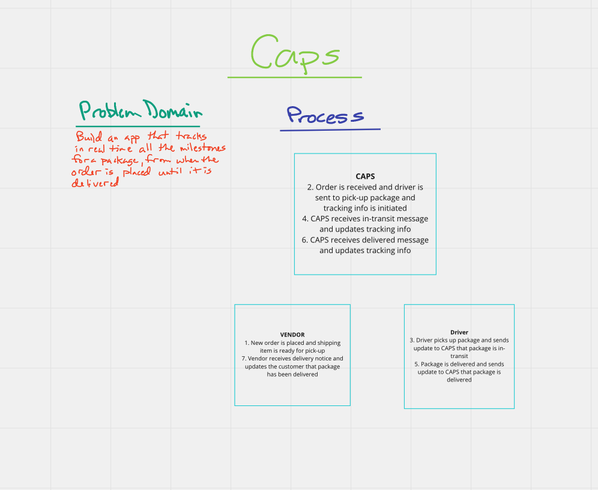

# Caps Project

> This project uses event driven development to track packages for CAPS(Code Academy(CodeFellows?) Parcel Shipping) from the moment the order is received until when it is delivered. This project will deliver real-time data for every milestone in the delivery process.

## Howe to use this app

- run  `node caps.js` in the terminal to see the output

### User Stories

1. As a vendor, I want to alert the system when I have a package to be picked up
1. As a driver, I want to be notified when there is a package to be delivered
1. As a driver, I want to alert the system when I have picked up a package and it is in transit
1. As a driver, I want to alert the system when a package has been delivered
1. As a vendor, I want to be notified when my package has been delivered
1. As a developer, I want to use industry standards for managing the state of each package
1. As a developer, I want to create an event driven system so that I can write code that happens in response to events, in real time

## Phase 1: Event Driven Applications

> Using built-in Node.js events to simulate realtime package delivery changes

## Technical Requirements

- events.js - Global Event Pool (shared by all modules)
- caps.js - Main Hub Application
  - Manages the state of every package (ready for pickup, in transit, delivered, etc)
  - Logs every event to the console with a timestamp and the event payload i.e. “EVENT {}”
- vendor.js - Vendor Module
  - Declare your store name (perhaps in a .env file, so that this module is re-usable)
  - Every 5 seconds, simulate a new customer order
  - Create a fake order, as an object:
    - storeName, orderId, customerName, address
  - Emit a ‘pickup’ event and attach the fake order as payload
  - Monitor the system for events …
  - Whenever the ‘delivered’ event occurs Log “thank you” to the console
- driver.js - Drivers Module
  - Monitor the system for events …
  - On the ‘pickup’ event …
    - Wait 1 second
    - Log “DRIVER: picked up [ORDER_ID]” to the console.
    - Emit an ‘in-transit’ event with the payload you received
  - Wait 3 seconds
  - Log “delivered” to the console
  - Emit a ‘delivered’ event with the same payload

## Approach & Efficiency

- My approach was to begin by mapping out the process of the package and determine where the key touch points live in the process. Once I knew that, then I could start to build the events and communication between CAPS, the vendor and the driver.

---

